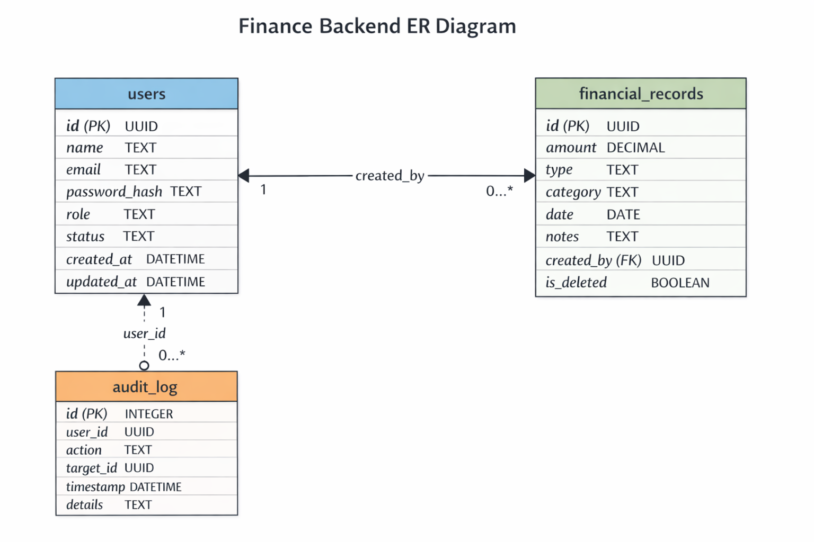

# Finance Backend

A production-grade REST API for finance data processing and access control.  
Built with **Node.js + Express + SQLite** — clean architecture, role-based access control, audit logging, and interactive API documentation.

---

## Tech Stack

| Layer | Choice | Reason |
|---|---|---|
| Runtime | Node.js 18+ | LTS, wide deployment support |
| Framework | Express.js | Minimal, explicit, battle-tested |
| Language | JavaScript (CommonJS) | No transpile step, clear require graph |
| Database | SQLite via `better-sqlite3` | Zero-infrastructure, synchronous API, WAL mode |
| Auth | JWT + bcryptjs | Stateless tokens, no session store needed |
| Validation | express-validator | Composable, inline with routes |
| Docs | swagger-ui-express | Live interactive docs from JSDoc |
| Security | helmet + express-rate-limit | HTTP hardening + brute-force protection |

---

## Architecture

```
finance-backend/
├── src/
│   ├── constants.js              # Roles, record types, audit actions — no magic strings
│   ├── app.js                    # Express setup: middleware, routes, error handler
│   ├── config/
│   │   ├── database.js           # SQLite singleton, schema init, indexes
│   │   └── swagger.js            # OpenAPI spec (schemas + server config)
│   ├── middleware/
│   │   ├── auth.js               # JWT Bearer verification → req.user
│   │   ├── roles.js              # requireRole(...roles) factory
│   │   └── errorHandler.js       # AppError + SQLite + JWT + 500 handler
│   ├── modules/                  # Feature modules: routes → controller → service
│   │   ├── auth/
│   │   ├── users/
│   │   ├── records/
│   │   └── dashboard/
│   └── utils/
│       ├── AppError.js           # Typed application error class
│       ├── asyncHandler.js       # Wraps async controllers — no try/catch needed
│       ├── response.js           # successResponse / errorResponse envelope
│       └── validators.js         # Reusable express-validator chains
├── scripts/
│   └── seed-demo.js              # Populates DB with 6 months of demo data
└── server.js                     # Entry point: init DB, seed admin, start + graceful shutdown
```

**Data flow for every request:**
```
Request → helmet/cors/rate-limit → morgan log → route
       → authenticate (JWT) → requireRole (RBAC)
       → validators → handleValidationErrors
       → asyncHandler(controller) → service (raw SQL)
       → successResponse / AppError → globalErrorHandler → JSON
```

---

## Role Permission Matrix

| Action | viewer | analyst | admin |
|---|:---:|:---:|:---:|
| Login / view own profile | ✅ | ✅ | ✅ |
| View financial records | ✅ | ✅ | ✅ |
| Filter / search records | ✅ | ✅ | ✅ |
| View dashboard summaries | ❌ | ✅ | ✅ |
| Create financial record | ❌ | ❌ | ✅ |
| Update financial record | ❌ | ❌ | ✅ |
| Soft-delete financial record | ❌ | ❌ | ✅ |
| View all users | ❌ | ❌ | ✅ |
| Create / update / deactivate user | ❌ | ❌ | ✅ |

---

## Setup

```bash
# 1. Clone
git clone <your-repo-url>
cd finance-backend

# 2. Install dependencies
npm install

# 3. Configure environment
cp .env.example .env
# Open .env and set a strong JWT_SECRET

# 4. Start development server
npm run dev
```

Server starts at **http://localhost:3000**

```
✅ Database initialised
✅ Default admin seeded — email: admin@finance.com  password: admin123
🚀 Server running on port 3000
📖 API docs: http://localhost:3000/api-docs
❤️  Health:   http://localhost:3000/health

```

## ER Diagram



### Load demo data (recommended for testing)

```bash
npm run seed
```

Seeds 4 users and 30 financial records across the last 6 months — makes dashboard endpoints return real data immediately.

---

## Default Credentials

| Role | Email | Password |
|---|---|---|
| admin | admin@finance.com | admin123 |
| analyst | alice@finance.com | alice123 |
| viewer | bob@finance.com | bob12345 |

> Change these before deploying to any public environment.

---

## API Reference

### Authentication — `/api/auth`

| Method | Endpoint | Auth | Role | Description |
|---|---|---|---|---|
| POST | `/api/auth/register` | None | — | Register a new user |
| POST | `/api/auth/login` | None | — | Login, receive JWT |
| GET | `/api/auth/me` | Bearer | Any | Get own profile |

### Users — `/api/users` (admin only)

| Method | Endpoint | Auth | Role | Description |
|---|---|---|---|---|
| GET | `/api/users` | Bearer | admin | List all users (`?status=active\|inactive`) |
| GET | `/api/users/:id` | Bearer | admin | Get single user |
| POST | `/api/users` | Bearer | admin | Create user |
| PATCH | `/api/users/:id` | Bearer | admin | Update name / role / status |
| DELETE | `/api/users/:id` | Bearer | admin | Deactivate user (soft) |

### Records — `/api/records`

| Method | Endpoint | Auth | Role | Description |
|---|---|---|---|---|
| GET | `/api/records` | Bearer | all | Paginated list with filters |
| GET | `/api/records/:id` | Bearer | all | Single record |
| POST | `/api/records` | Bearer | admin | Create record |
| PATCH | `/api/records/:id` | Bearer | admin | Partial update |
| DELETE | `/api/records/:id` | Bearer | admin | Soft delete |

**GET `/api/records` query parameters:**

| Param | Type | Example | Description |
|---|---|---|---|
| `type` | string | `income` | Filter by income or expense |
| `category` | string | `salary` | Filter by category (case-insensitive) |
| `from` | date | `2026-01-01` | Start date (inclusive) |
| `to` | date | `2026-03-31` | End date (inclusive) |
| `search` | string | `salary` | Searches notes and category |
| `page` | int | `1` | Page number (default 1) |
| `limit` | int | `10` | Per page, max 100 (default 10) |

### Dashboard — `/api/dashboard` (analyst + admin)

| Method | Endpoint | Auth | Role | Description |
|---|---|---|---|---|
| GET | `/api/dashboard/summary` | Bearer | analyst/admin | Totals: income, expenses, balance |
| GET | `/api/dashboard/by-category` | Bearer | analyst/admin | Grouped by category |
| GET | `/api/dashboard/trends` | Bearer | analyst/admin | Time-series (`?period=monthly\|weekly`) |
| GET | `/api/dashboard/recent` | Bearer | analyst/admin | Latest N records (`?limit=5`) |

### Utility

| Method | Endpoint | Auth | Description |
|---|---|---|---|
| GET | `/health` | None | Server health + uptime |
| GET | `/api-docs` | None | Swagger UI |
| GET | `/api-docs.json` | None | Raw OpenAPI JSON |

---

## Response Format

Every response uses a consistent envelope:

```json
// Success
{ "success": true, "data": {}, "message": "optional" }

// Error
{ "success": false, "error": { "message": "...", "code": "ERROR_CODE", "details": [] } }
```

**Common error codes:**

| Code | Status | Meaning |
|---|---|---|
| `VALIDATION_ERROR` | 422 | Input failed validation — see `details` array |
| `INVALID_CREDENTIALS` | 401 | Wrong email or password |
| `ACCOUNT_DEACTIVATED` | 403 | User status is inactive |
| `MISSING_TOKEN` | 401 | No Authorization header |
| `TOKEN_EXPIRED` | 401 | JWT expired |
| `FORBIDDEN` | 403 | Role lacks permission |
| `USER_NOT_FOUND` | 404 | No user with that ID |
| `RECORD_NOT_FOUND` | 404 | No record with that ID |
| `DUPLICATE_EMAIL` | 409 | Email already registered |
| `RATE_LIMITED` | 429 | Too many requests |

---

## Testing with Swagger

1. Open **http://localhost:3000/api-docs**
2. Expand `POST /auth/login` → **Try it out**
3. Enter `admin@finance.com` / `admin123` → **Execute**
4. Copy the `token` from the response
5. Click **🔒 Authorize** → enter `Bearer <token>` → **Authorize**
6. All subsequent requests are authenticated automatically

### Import into Postman

Postman → **Import** → paste URL:
```
http://localhost:3000/api-docs.json
```
Postman auto-generates the full collection.

---

## Environment Variables

| Variable | Default | Description |
|---|---|---|
| `PORT` | `3000` | Server port |
| `NODE_ENV` | `development` | Set to `production` to hide error stacks |
| `JWT_SECRET` | — | **Required.** Long random string |
| `JWT_EXPIRES_IN` | `7d` | Token lifetime |
| `DB_PATH` | `./database/finance.db` | SQLite file path |

---

## Design Decisions

**Raw SQL over ORM** — every query is visible, explicit, and auditable. No hidden N+1s, no migration files, no abstraction leakage. `better-sqlite3`'s synchronous API matches Express's synchronous middleware model perfectly.

**AppError class** — a single typed error class means the global error handler can distinguish intentional errors (400/403/404) from unexpected ones (500) without try/catch in every controller.

**asyncHandler wrapper** — eliminates `try/catch` boilerplate from all controllers. Errors propagate automatically to `globalErrorHandler` via Express's `next()`.

**Soft deletes** — financial records are never physically deleted. Setting `is_deleted = 1` preserves audit trails, enables recovery, and aligns with common accounting regulations.

**Audit log** — all mutations (create/update/delete record, create/update/deactivate user) are written to `audit_log` with the acting user's ID. This is a first-class requirement in any finance system.

**DB indexes** — indexes on `date`, `type`, `category`, `is_deleted`, and `created_by` ensure filter/sort queries stay fast as the records table grows.

**Rate limiting** — global 100 req/15 min per IP; stricter 20 req/15 min on auth endpoints to prevent brute-force attacks.

**User enumeration prevention** — login returns the same `Invalid email or password` message for both a missing account and a wrong password, preventing attackers from discovering valid emails.

---

## Assumptions

- `POST /api/auth/register` is public for initial setup convenience. In production, restrict it to admin-only or remove it.
- Dates are stored and expected as `YYYY-MM-DD` strings. No timezone conversion is applied — consumers are responsible for their timezone.
- SQLite is appropriate for this scale. For multi-process or high-concurrency deployments, migrate to PostgreSQL.
- The `audit_log` table intentionally has no foreign key constraint on `user_id` so audit entries survive user deactivation.

---

## Known Limitations & Future Work

| Limitation | Suggested fix |
|---|---|
| No refresh tokens | Add a `refresh_tokens` table + `POST /auth/refresh` |
| SQLite not persistent on Railway by default | Mount a Railway Volume at `/app/database` |
| No email verification | Integrate SendGrid / Resend on register |
| No test suite | Add Jest + supertest for route integration tests |
| Single-process only | Move to PostgreSQL for horizontal scaling |
